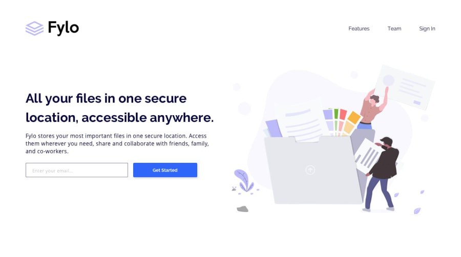

# This is a collaborative design by AltSchool Africa students (Circle-9) inspired by Frontend Mentor
The name of the project will be Circle-9 - A cloud hosting platform

## Welcome! 👋
**To do this challenge, you need a basic understanding of HTML and CSS.**

## The challenge

Your challenge is to build out this landing page and get it looking as close to the design as possible.
As team members we are basically using HTML and CSS for this project and the project will be divided into four part;

============================================================
### 1. The Header Section

============================================================
### 2. Productive Section (2nd Section)
.png)

============================================================
### 3. Newsletter Section
.png

============================================================
### 4. Footer Section
.png)

## Where to find everything

Your task is to build out the project to the designs inside the `/design` folder. You will find both a mobile and a desktop version of the design. 

The designs are in JPG static format. Using JPGs will mean that you'll need to use your best judgment for styles such as `font-size`, `padding` and `margin`. 

You will find all the required assets in the `/images` folder. The assets are already optimized.

There is also a `style-guide.md` file containing the information you'll need, such as color palette and fonts.

## Building your project

Feel free to use any workflow that you feel comfortable with. Below is a suggested process, but do not feel like you need to follow these steps:
1. Clone the remote Git repo locally: 
`git clone https://github.com/InfoTechDrive/circle9-cloudhost.git`

2. Create a new branch with the branch, switch or checkout commands
`git switch -c name-of-task`
`git branch -a` - to verify branch

3. Perform a git push with the –set-upstream option to set the remote repo for the new branch
`git add .`
`git commit -m "name-of-the-task"
`git push --set-upstream origin new-branch`

4. Continue to perform Git commits locally on the new branch
5. Simply use a `git push origin` command on subsequent pushes of the new branch to the remote repo

## Deploying your project

As mentioned above, there are many ways to host our project for free. Our recommend hosts are:

- [GitHub Pages](https://pages.github.com/)
- [Vercel](https://vercel.com/)
- [Netlify](https://www.netlify.com/)

You can host your site using one of these solutions or any of our other trusted providers. [Read more about our recommended and trusted hosts](https://medium.com/frontend-mentor/frontend-mentor-trusted-hosting-providers-bf000dfebe).

## Got feedback for us?
Kindly reach out to the team member via WhatsApp

This project is completely free. Please share it with anyone who will find it useful for practice.

**Have fun building!** 🚀
